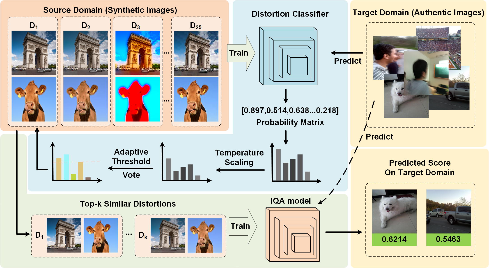

# ASDS-IQA: Cross-domain Image Quality Assessment via Adaptive Similarity Domain Selection

  
*Figure 1: The overall framework of ASDS-IQA method*

## Overview
ASDS-IQA is a novel cross-domain image quality assessment method that adaptively selects similar source domain data for effective target domain quality prediction. The method consists of four key steps that leverage domain similarity to improve cross-domain IQA performance.

## Requirements
The code is implemented using Python with the following key dependencies:
- Python 3.7+
- PyTorch 1.8+
- torchvision
- NumPy
- SciPy
- timm
- tqdm

## Implementation Steps

### 1. Train Classifier on Source Domain (KADID-10K)
```bash
python classifier_train_test.py

### 2. Target Domain Voting (e.g., LIVEC)
```bash
python vote.py

### 3. Train IQA Model on Selected Data
 ```bash
python train_test.py

### 4. Test on Target Domain
 ```bash
python evaluate.py

## Acknowledgement
@ARTICLE{9817377,
  author={Pan, Zhaoqing and Zhang, Hao and Lei, Jianjun and Fang, Yuming and Shao, Xiao and Ling, Nam and Kwong, Sam},
  journal={IEEE Transactions on Circuits and Systems for Video Technology}, 
  title={DACNN: Blind Image Quality Assessment via a Distortion-Aware Convolutional Neural Network}, 
  year={2022},
  volume={32},
  number={11},
  pages={7518-7531},
  doi={10.1109/TCSVT.2022.3188991}
}
